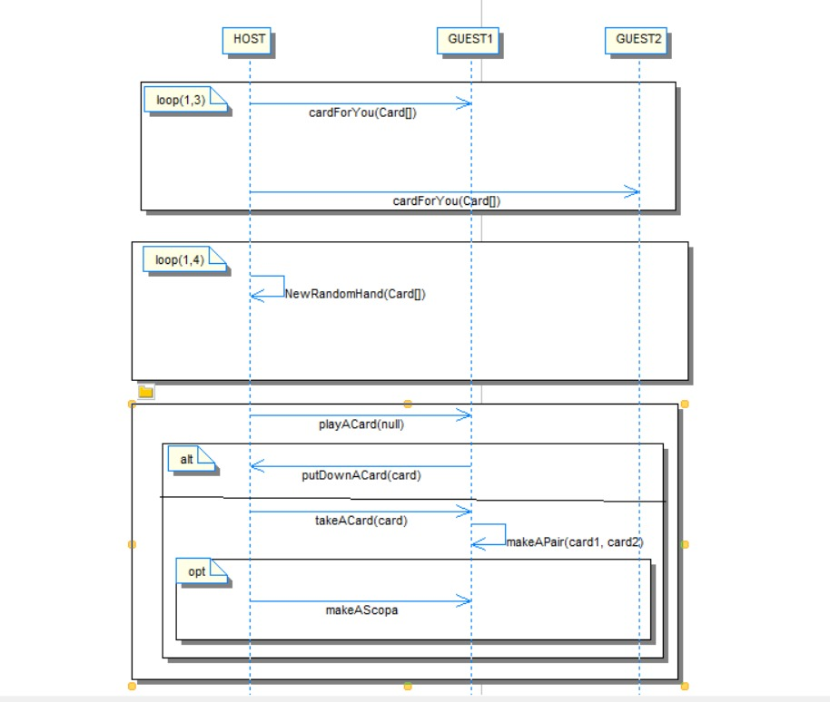

# Règles

Le jeu se joue à au moins deux joueurs et en nombre pairs et comporte un maitre du jeu non joueur.

## Mise en place

On distribue 3 cartes à chaque joueur et on en pose 4 face découverte sur la table. Si parmi ces cartes il y a 3 ou 4 rois, on ne pourra pas faire de "scopa" durant la partie, on remet donc 4 autres cartes.

## Déroulé de la partie

Les joueurs procèdent de la façon suivante : 
-	soit une pair est possible, c’est-à-dire que le joueur peut récupérer une carte de la table avec une de ses cartes de la même valeur ;
-	soit une scopa est possible, c’est-à-dire qu’en faisait un pli, le joueur récupère la totalité des cartes sur la table ; 
-	soit rien n’est pas possible, le joueur dépose donc la carte de son choix sur la table.
A la fin de chaque tour, une carte est distribuée à chaque joueur pour qu’ils en aient toujours 3.

## Fin de la partie

A la fin de la partie les points sont répartis de la manière suivante :
-	1 point pour le joueur qui a le plus de cartes ;
-	1 point pour le joueur qui a le settebello (7 de deniers) ;
-	1 point pour le joueur qui a le plus de cartes de deniers ; 
-	1 point pour chaque "scopa" effectuée.
- Il n'y a pas de gagnant si 2 (ou plus) joueurs sont à égalité (ont le même nombre de points)
- Le gagnant est celui qui a le plus de points.

### Détail des classes principales

Un exemple de jeu supportant le réseau

* LocalGame qui lance le jeu
* LocalGameEngine qui supporte les méthodes du jeu local
* WarGameNetorkPlayer le joueur distant en cas de partie réseau
* WarGameNetworkEngine la version du jeu supportant le réseau

# Protocole réseau

> Le protocole réseau définit les séquences des commandes échangées entre les différentes parties prenantes. Il doit contenir, pour chaque commande, l'expéditeur, le destinataire, le nom de la commande et le contenu du corps de la commande.

